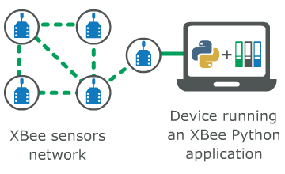

XBee Python Library
===================

XBee devices allow you to enable wireless connectivity to your projects creating
a network of connected devices. They provide features to exchange data with
other devices in the network, configure them and control their I/O lines. An
application running in an intelligent device can take advantage of these
features to monitor and manage the entire network.

Despite the available documentation and configuration tools for working with
XBee devices, it is not always easy to develop these kinds of applications.

The XBee Python Library is a Python API that dramatically reduces the time to
market of XBee projects developed in Python and facilitates the development of
these types of applications, making it an easy and smooth process. The XBee
Python Library includes the following features:

* Support for multiple XBee devices and protocols.
* High abstraction layer provides an easy-to-use workflow.
* Ability to configure local and remote XBee devices of the network.
* Discovery feature finds remote nodes on the same network as the local module.
* Ability to transmit and receive data from any XBee device on the network.
* Ability to manage the General Purpose Input and Output lines of all your XBee
  devices.

This portal provides the following documentation to help you with the different
development stages of your Python applications using the XBee Python Library.

Requirements
============

* Python 3
* PySerial 3

Contents
========

User Documentation

* :doc:`getting_started_with_xbee_python_library`
* :doc:`xbee_terminology`
* :doc:`working_with_xbee_classes`
* :doc:`configuring_the_xbee_device`
* :doc:`discovering_the_xbee_network`
* :doc:`communicating_with_xbee_devices`
* :doc:`handling_analog_and_digital_io_lines`
* :doc:`logging_events`
* :doc:`examples`
* :doc:`faq`

.. toctree::
   :maxdepth: 4
   :hidden:
   :caption: User Documentation

   getting_started_with_xbee_python_library
   xbee_terminology
   working_with_xbee_classes
   configuring_the_xbee_device
   discovering_the_xbee_network
   communicating_with_xbee_devices
   handling_analog_and_digital_io_lines
   logging_events
   examples
   faq

Indices and tables
==================

* :ref:`genindex`
* :ref:`modindex`
* :ref:`search`

License
=======

Copyright (c) 2017 Digi International Inc., All rights not expressly granted
are reserved.

This Source Code Form is subject to the terms of the Mozilla Public
License, v. 2.0. If a copy of the MPL was not distributed with this file,
You can obtain one at http://mozilla.org/MPL/2.0/.

Digi International Inc. 11001 Bren Road East, Minnetonka, MN 55343
